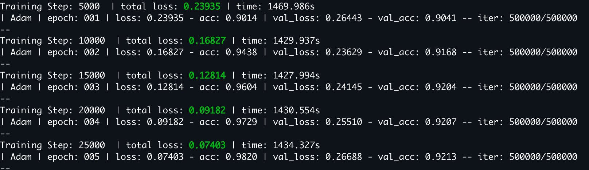

# Amazon Sentiment Analysis
Perform sentiment analysis on the Amazon Fine Food Reviews dataset using TFLearn. Load data from an SQL database, construct a vocabulary processor, and test several deep learning models with variable parameters. 

## Dataset
The Amazon Fine Food Reviews dataset is available on Kaggle and consists of 568,454 reviews of Amazon food items ([link](https://www.kaggle.com/snap/amazon-fine-food-reviews)). The database contains the following information:
- Id
- ProductId - unique identifier for the product
- UserId - unqiue identifier for the user
- ProfileName
- HelpfulnessNumerator - number of users who found the review helpful
- HelpfulnessDenominator - number of users who indicated whether they found the review helpful
- Score - rating between 1 and 5
- Time - timestamp for the review
- Summary - brief summary of the review
- Text - text of the review

## Analysis
Scores and product reviews from the database are used to train a model that can predict if a review is negative, neutral, or positive based only the text contained in the review. The scores are given on a scale of 1 to 5. For this analysis the scores were grouped using the following convention: 1,2 = negative, 3 = neutral, and 4,5 = positive. 

There are three base models available (contained in models.py): CNN, RNN w/ LSTM, and RNN w/ GRU. The loading of the dataset and vocabulary processing are handled in vocab.py. 

## Usage
The script is run with main.py and requires that a model be specified with '-m'. For example 
```bash
$ python main.py -m cnn
```
The acceptable model names are cnn, rnn_lstm, or rnn_gru. The following optional arguments are also available:
- -b, batch size used for training: default=50
- -c, number of classes for softmax: default=3
- -d, whether to use dynamic rnn, bool: default=False
- -e, number of training epochs: default=5
- -f, minimum frequency for a word to be included in vocab processor: default=2
- -l, maximum length of text for vocab processor: default=200
- -m, name of model to use: options are 'cnn', 'rnn_gru', or 'rnn_lstm'
- -p, path to vocab processor model. Loaded if it already exists, created and saved if not: default=None
- -q, path to sql database: default='./database.sqlite'
- -s, number of samples to use for training: default=500000
- -u, number of hidden units: default=128
- -v, Tensorboard verbosity value, 0-3: default=0

Example: Dynamic RNN w/ GRU, save/load vocab processor as 'my_dictionary', batch_size of 100
```bash
$ python main.py -m rnn_gru -d True -b 100 -p my_dictionary
```


